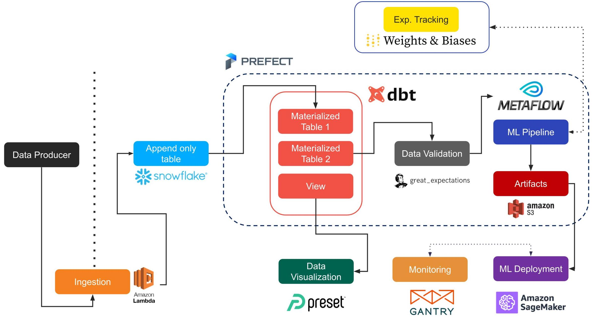

# You Don't Need a Bigger Boat
An end-to-end (Metaflow-based) implementation of an intent prediction (and session recommendation) flow for kids who can't MLOps
good and [wanna learn to do other stuff good too](https://www.youtube.com/watch?v=NQ-8IuUkJJc).

This is a WIP - check back often for updates.

## Philosophical Motivations
There is plenty of tutorials and blog posts around the Internet on data pipelines and tooling. However:

* they (for good pedagogical reasons) tend to focus on _one_ tool / step at a time, leaving us to wonder how
the rest of the pipeline works;
* they (for good pedagogical reasons) tend to work in a toy-world fashion, leaving us to wonder what would happen
when a real dataset and a real-world problem enter the scene.

This repository (and soon-to-be-drafted written tutorial) aims to fill these gaps. In particular:

* we provide open-source working code that glues together what we believe are some of the best tools in the ecosystem,
going  _all the way_ from raw data to a deployed endpoint serving predictions;
* we run the pipeline under a realistic load for companies at "[reasonable scale](https://www.youtube.com/watch?v=Ndxpo4PeEms)", leveraging
a huge [open dataset](https://arxiv.org/abs/2104.09423) we released in 2021; moreover, we train a model for a real-world
use case, and show how to monitor it after deployment.

The repo may also be seen as a (very opinionated) introduction to modern, PaaS-like pipelines (as also discussed [here](https://www.youtube.com/watch?v=Ndxpo4PeEms)); while there is obviously room for disagreement over tool X or tool Y, we believe the general principles to be sound for companies at
"reasonable scale": in-between bare-bone infrastructure for Tech Giants, and ready-made solutions for low-code/simple
scenarios, there is a world of exciting machine learning at scale for sophisticated practitioners who don't want to
waste their time managing cloud resources.

*Note #1*: while the code is provided as an end-to-end solution, we may sacrifice some terseness for clarity / pedagogical reasons.

*Note #2*: when we say the pipeline is an "end-to-end solution", we *mean* it - it goes from millions of raw events
to a working endpoint that you can ping. As such, there are *many* moving pieces and it may take a while to understand how all the pieces fit together: this is not meant to be a recipe for building a small ML-powered feature, but a template for building an entire AI company (at least, the beginning of one) - as such, the learning curve is a bit steeper, but you will be rewarded with a ML stack tried and tested at [unicorn](https://en.wikipedia.org/wiki/Unicorn_(finance)) scale.

## Overview
The repo shows how several (mostly open-source) tools can be effectively combined together to run data pipelines at scale with very small teams. The
project now features:

* [Metaflow](https://metaflow.org/) for ML DAGs (Alternatives: [Luigi](https://github.com/spotify/luigi) (?))
* [Snowflake](https://www.snowflake.com/) as a data warehouse solution (Alternatives: [Redshift](https://aws.amazon.com/redshift/))
* [Prefect](https://www.prefect.io/) as a general orchestrator (Alternatives: [Airflow](https://airflow.apache.org), or even Step Functions on AWS)
* [dbt](https://www.getdbt.com) for data transformation (Alternatives: ?)
* [Great Expectations](https://greatexpectations.io/) for data quality (Alternatives: [dbt-expectations plugin](https://github.com/calogica/dbt-expectations))
* [Neptune.ai](https://neptune.ai/) for experiement tracking, data and model versioning(Alternatives: [Weights&Biases](https://wandb.ai/site), [Comet](https://www.comet.ml/), [MLflow](https://www.mlflow.org/))
* [Weights&Biases](https://wandb.ai/site) for experiment tracking (Alternatives: [Comet](https://www.comet.ml/))
* [Sagemaker](https://aws.amazon.com/sagemaker/) / [Lambda](https://aws.amazon.com/lambda/) for model serving (Alternatives: many)

The following picture from [Recsys](https://dl.acm.org/doi/10.1145/3460231.3474604) gives a quick overview of a similar pipeline:



We provide _two versions_ of the pipeline, depending on the sophistication of the setup:

* a _Metaflow-only_ version, which runs from static data files to Sagemaker as a single Flow, and can be run
from a Metaflow-enabled laptop without much additional setup;
* a _data warehouse_ version, which runs in a more realistic setup, reading data from Snowflake and using an external
orchestrator to run the steps. In this setup, the downside is that a Snowflake and a Prefect Cloud accounts are required
(nonetheless, both are veasy to get); the upside is that the pipeline reflects almost perfectly a real setup, and Metaflow
can be used specifically for the ML part of the process.

The parallelism between the two scenarios should be pretty clear by looking at the two projects: if you are familiarizing with
all the tools for the first time, we suggest you to start from the _Metaflow_ version and then move to the full-scale one
when all the pieces of the puzzle are well understood.

*Note*: if you are new to Metaflow, we recommend you to go through the [official installation](https://docs.metaflow.org/getting-started/install) and this [stand-alone tutorial](https://github.com/jacopotagliabue/no-ops-machine-learning) first.

### Relevant Material

If you want to know more, you can give a look at the following material:

* ["MLOps without much Ops"](https://towardsdatascience.com/tagged/mlops-without-much-ops), `TDS Blog Series`, September 2021;
* ["ML Ops at Reasonable Scale"](https://www.youtube.com/watch?v=Ndxpo4PeEms) (video), `Stanford MLSys`, July 2021;
* ["You Do Not Need a Bigger Boat: Recommendations at Reasonable Scale in a (Mostly) Serverless and Open Stack"](https://dl.acm.org/doi/10.1145/3460231.3474604) [pre-print](https://arxiv.org/abs/2107.07346), `RecSys 2021`.

*TBC*

## Status Update

*September 2021*

*  Added to the `local` folder a new recommender flow as described [here](https://dl.acm.org/doi/10.1145/3460231.3474604).
*  Started a [blog series](https://towardsdatascience.com/tagged/mlops-without-much-ops) explaining in detail the philosophy behind the approach.
*  Started adding [DAG cards](https://github.com/jacopotagliabue/dag-card-is-the-new-model-card) to the official Metaflow codebase.

TO-DOs:

* finish feature store and monitoring integration;
* add Github Action flow;
* standardize AWS permissions / users (as now most commands are still launched as admin users);
* providing an orchestrator-free version, by using step functions to manage the steps;

Want to join us and collaborate on the above? Please reach out!

## Setup
 
### General Prerequisites (do this first!)

Irrespectively of the flow you wish to run, some general tools need to be in place: Metaflow of course, 
as the heart of our ML practice, but also data and AWS users/roles. *Please go through the general items below before
tackling the flow-specific instructions*. 

After you finish the prerequisites below, you can run the flow you desire: each folder - `remote` and `local` - contains 
a specific README which should allow you to quickly run the project end-to-end: please refer to that documentation for 
flow-specific instructions (check back often for updates).

#### Dataset

The project leverages the open dataset from the [2021 Coveo Data Challenge](https://github.com/coveooss/SIGIR-ecom-data-challenge):
the dataset can be downloaded directly from [here](https://www.coveo.com/en/ailabs/sigir-ecom-data-challenge) (refer to the
full [README](https://github.com/coveooss/SIGIR-ecom-data-challenge) for terms and conditions).
Data is freely available under a research-friendly license - for background information on the dataset, 
the use cases and relevant work in the ML literature, please refer to the 
accompanying [paper](https://arxiv.org/abs/2104.09423).

Once you download and unzip the dataset in a local folder of your choice 
(the zip contains 3 files, `browsing_train.csv`, `search_train.csv`, `sku_to_content.csv`), 
write down their location as an absolute path (e.g. `/Users/jacopo/Documents/data/train/browsing_train.csv`): 
both projects need to know where the dataset is.

#### AWS

Both projects  - `remote` and `local` - use AWS services extensively - and by design: this ties back to our philosophy 
of PaaS-whenever-possible, and play nicely with our core adoption of Metaflow. While you can setup your users in many
functionally equivalent ways, note that if you want to run the pipeline from ingestion to serving you need to be 
comfortable with the following AWS interactions:

* Metaflow stack (see below): we assume you installed the Metaflow stack and can run it with an AWS profile of your choice;
* Serverless stack (see below): we assume you can run `serverless deploy` in your AWS stack;
* Sagemaker user: we assume you have an AWS user with permissions to manage Sagemaker endpoints (it may be totally
distinct from any other Metaflow user).

*TBC*

#### Serverless

We wrap Sagemaker predictions in a serverless REST endpoint provided by AWS Lambda and API Gateway. To manage the lambda
stack we use [Serverless](https://www.serverless.com/cli/) as a wrapper around AWS infrastructure.

*TBC*

#### Metaflow

##### Metaflow: Configuration

If you have an AWS profile configured with a metaflow-friendly user, and you created
metaflow stack with CloudFormation, you can run the following command with the resources
created by CloudFormation to set up metaflow on AWS:

`metaflow configure aws --profile metaflow`

Remember to use `METAFLOW_PROFILE=metaflow` to use this profile when running a flow. Once
you completed the [setup](https://admin-docs.metaflow.org/metaflow-on-aws/deployment-guide/aws-cloudformation-deployment), you can run `flow_playground.py` to test the AWS setup is working as expected (in particular, GPU batch jobs can run correctly). To run the flow with the custom profile created, you should do:

`METAFLOW_PROFILE=metaflow python flow_playground.py run`

##### Metaflow: Tips & Tricks

1. Parallelism Safe Guard
	- The flag `--max-workers` __should__ be used to limit the maximum number of parallel steps
	- For example `METAFLOW_PROFILE=metaflow python flow_playground.py run --max-workers 8` limits
		the maximum number of parallel tasks to 8
2. Environment Variables in AWS Batch
	- The `@environment` decorator is used in conjunction with `@batch` to pass environment variables to
		AWS Batch, which will not directly have access to env variables on your local machine
	- In the `local` example, we use `@environemnt` to pass the Neptune.ai or Weights & Biases API Key, Project name (amongst other things)
3. Resuming Flows
	- Resuming flows is useful during development to avoid re-running compute/time intensive steps
		such as data preparation
	- `METAFLOW_PROFILE=metaflow python flow_playground.py resume <STEP_NAME> --origin-run-id <RUN_ID>`
4. Local-Only execution
	- It may sometimes be useful to debug locally (i.e to avoid Batch startup latency), we introduce a wrapper
		`enable_decorator` around the `@batch` decorator which enables or disables a decorator's functionality
	- We use this in conjunction with an environment variable `EN_BATCH` to toggle the functionality
		of __all__ `@batch` decorators.

## FAQ

1. Both projects deal with data that has already been ingested/transmitted to the pipeline, but are silent on data collection.
Any serverless option there as well?

   *Yes*. In e-commerce use cases, for example, pixel tracking is standard (e.g. [Google Analytics](https://analytics.google.com/analytics/web/)),
   so a serverless `/collect` endpoint can be used to get front-end data and drop it in a pure PaaS pipeline with [Firehose](https://aws.amazon.com/kinesis/data-firehose/)
   and Snowpipe, for example. While a bit out-dated for some details, we championed exactly this approach a while ago: if you
   want to know more, you can start from this [Medium](https://medium.com/tooso/server-less-is-more-98d4275c37ae) post 
   and old [code](https://github.com/jacopotagliabue/pixel_from_lambda).

*TBC*

## Contributors

* [Jacopo Tagliabue](https://www.linkedin.com/in/jacopotagliabue/): general design and Metaflow fan boy;
* [Patrick John Chia](https://www.linkedin.com/in/patrick-john-chia-b0a34019b/): local flow and baseline model;
* [Luca Bigon](https://www.linkedin.com/in/bigluck/): general engineering and infra optimization;
* [Andrew Sutcliffe](https://www.linkedin.com/in/asutcl/): remote flow;
* [Leopoldo Garcia Vargas](https://www.linkedin.com/in/leopoldo-garcia-vargas-29932a89/): QA and tests.

## How to Cite our Work

If you find our principles, code or data useful, please cite our work:


*Paper (RecSys2021)*
```
@inproceedings{10.1145/3460231.3474604,
author = {Tagliabue, Jacopo},
title = {You Do Not Need a Bigger Boat: Recommendations at Reasonable Scale in a (Mostly) Serverless and Open Stack},
publisher = {Association for Computing Machinery},
address = {New York, NY, USA},
url = {https://doi.org/10.1145/3460231.3474604},
doi = {10.1145/3460231.3474604},
series = {RecSys '21}
}

```

*Data*
```
@inproceedings{CoveoSIGIR2021,
author = {Tagliabue, Jacopo and Greco, Ciro and Roy, Jean-Francis and Bianchi, Federico and Cassani, Giovanni and Yu, Bingqing and Chia, Patrick John},
title = {SIGIR 2021 E-Commerce Workshop Data Challenge},
year = {2021},
booktitle = {SIGIR eCom 2021}
}
```
