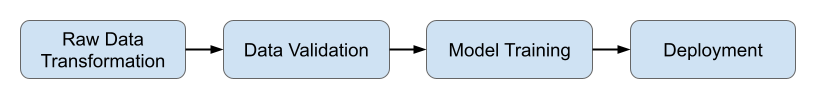

# Local Flow


## Overview



This version of the pipeline utilizes Metaflow as the main pipeline orchestrator.
We provide two local flows, one deploying a model for intent prediction (cart abandonment), another deploying a model for recommendation prediction.
This README provides an overview of the local version of the pipeline and contains setup instructions specific to this local version as a whole,
as well as instructions that may be specific to the intent prediction model or recommendation model.
For the general prerequisites, Metaflow setup and background information about the pipeline, please refer to the main README.


As seen in the above diagram, there are four main steps in the flow:

1. Data Transformation: The dataset is read from S3 and transformed/wrangled using a GPU accelerated library [RAPIDS](https://rapids.ai/).
2. Data Validation: [Great Expectations](https://greatexpectations.io/) is used to perform data validation on the transformed data.
3. Model Training: Keras (or other ML Libraries) is used to train the model and experiment tracking is done via Neptune.ai or Weights & Biases.
4. Model Serving: The trained model is deployed on SageMaker and is exposed via a public Lambda endpoint.

[comment]: <> (   Gantry is used here for model monitoring.)

## Environment

We suggest the use of `virtualenv` to organize dependencies.

A `Makefile` has also been provided to help you launch the proper commands. It passes into commands, environment variables
such as `AWS_PROFILE` as specified in the file `.env`. You can also pass environment variables through `make` for e.g.:

  ```
  $ AWS_PROFILE=my_profile make deploy
  ```

Note that if the same variables is defined in `.env` it will take precedence.

To create a virtualenv for the local flow:

1. `cd` into the `local_flow` directory
2. Create the virtualenv with the following command

  ```
  $ python -m venv local-flow-env
  ```
3. Activate the venv with the following command

  ```
  $ source local-flow-env/bin/activate
  ```

## Requirements / Prerequisites

We specify certain variables and secrets in an environment file `.env` and load them
during runtime using `dotenv`. Make a copy of `example.env` and rename it as `.env`.

We describe the basic setup required to run this flow, and the environment variables required below.

### Packages

- Install required python packages as per `requirements.txt` in `local_flow/intent` or `local_flow/rec`:
  ```
  $ pip3 install -r requirements.txt
  ```
- For `rec`, installation of `prodb` is required and can be found [here](https://github.com/vinid/prodb).

[comment]: <> (- Install Gantry as per the gantry [guide]&#40;https://docs.gantry.io/en/latest/how-to/installation.html&#41;.)

### Docker Images

Several docker images are required for use with AWS Batch in Metaflow and
for model serving on SageMaker. See [here](https://github.com/aws/deep-learning-containers/blob/master/available_images.md)
for images made available by AWS.

- `BASE_IMAGE`: Docker image for GPU training
- `RAPIDS_IMAGE`: Docker image with [RAPIDS installed](https://rapids.ai/start.html#get-rapids)
- `DOCKER_IMAGE`: Docker image for Sagemaker endpoint


- For `rec`, model training requires either [prodb](https://github.com/vinid/prodb) or [gensim](https://radimrehurek.com/gensim/).
It is advised to have these pre-packaged into the `BASE_IMAGE` docker image.

### Neptune.ai 
To utilise Neptune, you need to obtain your account [API Token](https://docs.neptune.ai/getting-started/installation#authentication-neptune-api-token) and specify the [project](https://docs.neptune.ai/getting-started/installation#setting-the-project-name) you want to log Runs to. You can create an account [here](https://app.neptune.ai/register/).

Further information about Neptune environment variables can be found [here](https://docs.neptune.ai/api-reference/environment-variables).

- `NEPTUNE_API_TOKEN`: The API token used for authentication.
- `NEPTUNE_PROJECT`: The project in which new runs will be created.
- `NEPTUNE_CUSTOM_RUN_ID`: A unique identifier that can be used to log metadata to a single run from multiple files or processes.

### Weights & Biases

To utilise Weights & Biases, you need to obtain your account specific API key and specify the entity which you
want to associate your tracking with. You can create an account [here](https://app.wandb.ai/login?signup=true).
Further information about Weights & Biases environment variables can be found
[here](https://docs.wandb.ai/guides/track/advanced/environment-variables).

- `WANDB_API_KEY`
- `WANDB_ENTITY`: Your Weights & Biases username or team name (if you are account is linked to a team)

### Sagemaker

You need to have appropriate permissions for Sagemaker in AWS and specify the instance type for use in deployment.
  - `IAM_SAGEMAKER_ROLE`
  - `SAGEMAKER_INSTANCE`: AWS instance types can be found [here](https://aws.amazon.com/ec2/instance-types/).

### Local Dataset Upload

We store the CSV dataset in S3 as parquet files which allows for quick access by Metaflow. We utilise the S3 bucket previously
configured for use with Metaflow (i.e. `METAFLOW_DATATOOLS_SYSROOT_S3`).

- `local_dataset_upload.py` performs the upload of the `.csv` dataset files
  (`browsing_train.csv`, `search_train.csv`, ...) into metaflow S3
  datastore as `.parquet` files at `PARQUET_S3_PATH`;
- Specify the absolute paths to the dataset files in the following environment variables:
    - `BROWSING_TRAIN_PATH`
    - `SEARCH_TRAIN_PATH`
    - `SKU_TO_CONTENT_PATH`
- Note that there is no versioning of the dataset;
- Execute the following to upload the dataset (this might take a while depending
  on your internet connection):
  ```
  $ make upload
  ```

### ML Model Configuration

#### Intent Prediction Model
We define the parameters for the intent prediction model in a `config.json` as specified in
the environment variable `MODEL_CONFIG_PATH`.

#### Recommendation Model
Since there are two types models available for recommendation, we distinguish their parameters by having one
configuration file for each (i.e `config_KNN.json` and `config_PRODB.json`)

The environment variable `MODEL_CONFIG_PATH` specifies the basename `config_<MODEL_CHOICE>.json` and the model selected for
use is specified by the environment variable `MODEL_CHOICE` which accepts only `KNN` or `PRODB` as value.

### Serverless

For serverless, we utilize the Serverless [IAM Roles per function](https://www.serverless.com/plugins/serverless-iam-roles-per-function)
plugin. This will grant the Lambda function the necessary privileges to access the SageMaker endpoint.

The AWS profile used for deployment can be specified in `.env` with the variables:
- `AWS_PROFILE`
- `AWS_DEFAULT_REGION`


## How to Run

First, ensure that you have set the above mentioned environment variables, and have successfully
performed the dataset upload into S3 as described above. Please note that if you want to run the flow
without AWS batch, you should set the `EN_BATCH` variable in `.env` to `0`.

### Running Metaflow

- Execute from the directory `local_flow/intent` or `local_flow/rec`;
- Execute the following to initiate a run:

  ```
  $ make run
  ```
- You can also specify the Metaflow profile associated with your Metaflow setup as per the main README:

  ```
  $ METAFLOW_PROFILE=<METAFLOW_PROFILE_NAME> make run
  ```

### Running Serverless
-  Once the flow is completed, we can expose the SageMaker model via a serverless endpoint;
-  Obtain `SAGE_MAKER_ENDPOINT_NAME` from output of `deploy` step in Metaflow;
-  Execute the following:
    ```
    $ SAGEMAKER_ENDPOINT_NAME=<SAGEMAKER_ENDPOINT_NAME> make deploy
    ```
- Another way to specify an AWS profile that is configured with the required permissions for serverless is as follows,
  ```
  $ AWS_PROFILE=<AWS_SERVERLESS_PROFILE> SAGEMAKER_ENDPOINT_NAME=<SAGEMAKER_ENDPOINT_NAME> make deploy
  ```


- Test your endpoint for intent prediction, pass in a sequence of click events such as,
  ```
  https://<SERVERLESS_ENDPOINT>/dev/predict?session=add,view,remove
  ```

- Test your endpoint for recommendation, pass in a sequence of product SKU such as,
  ```
  https://<SERVERLESS_ENDPOINT>/dev/predict?session=<SKU1>,<SKU2>
  ```

