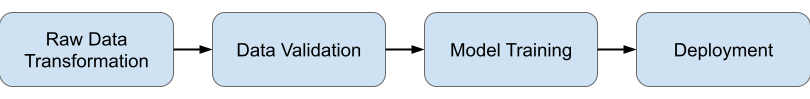

#Local Flow


## Overview
- - -



This version of the pipeline utilises Metaflow as the main orchestrator.

There are 4 logical steps in the flow

1. Data Transformation: The dataset is read from S3 and transformed using GPU accelerated library [RAPIDS](https://rapids.ai/).
2. Data Validation: [Great Expectations](https://greatexpectations.io/) is used to perform data validation.
3. Model Training: Model is trained using Keras (or other  ML Libraries) and tracking is done via Weights & Biases and Gantry.
4. Model Serving: The trained model is deployed on SageMaker and is exposed via a public Lambda endpoint.


## Requirements
- - -
### Packages

- Install required python packages as per `requirements.txt` in main folder;
- Install gantry as per the gantry [guide](https://docs.gantry.io/en/latest/tutorials/local.html).

### Docker Images

Several docker images are required when using AWS Batch in Metaflow

- `BASE_IMAGE`: Docker image for GPU training
- `RAPIDS_IMAGE`: Docker image with [RAPIDS](https://rapids.ai/) installed 
- `DOCKER_IMAGE`: Docker image for Sagemaker endpoint 

### Weights & Biases
To utilise Weights & Biases, you need to obtain your account specific API key and specify the entity which you
want to associate your tracking with.

- `WANDB_API_KEY`
- `WANDB_ENTITY`

### Sagemaker
You need to have appropriate permissions for Sagemaker in AWS and specify the instance type for deployment.
- `IAM_SAGEMAKER_ROLE` 
- `SAGEMAKER_INSTANCE`

### Local Dataset Upload  

We store the dataset in S3 which allows for quick access by Metaflow.

- `local_dataset_upload.py` performs upload of `.csv` dataset files into metaflow S3 datastore as `.parquet` files at `PARQUET_S3_PATH`
- The datasets are obtained based on paths specified in the environment variables: 
    - `BROWSING_TRAIN_PATH`
    - `SEARCH_TRAIN_PATH`
    - `SKU_TO_CONTENT_PATH`
- Note that there is no versioning of the dataset


## How to Run
- - -
### Running Metaflow

- Execute from the directory `model_flow`
- Due to Great Expectations, `--no-pylint` flag is required
- Execute the following to initate a run:  
  ```
    python src/cart_baseline_flow.py --no-pylint run --max-workers 8  
  ```

### Running Serverless

- `cd` into serverless folder
-  Execute:
   ```
   serverless deploy --sagemaker <SAGEMAKER_ENDPOINT_NAME>
   ```
- `SAGE_MAKER_ENDPOINT_NAME` is obtained from output of `deploy` step in Metaflow
- Test endpoint by passing in events as a string : `session=add,cart,view,remove`