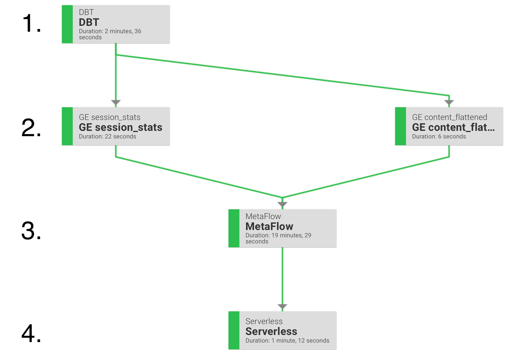

# Welcome to your remote flow.

## #Overview

We used Prefect to orchestrate the different stage of the end-to-end process. Prefect will construct a run a DAG
comprised of: 
1. A data preparation task using DBT
2. Data validation tasks using Great Expectations
3. A model training task using Metaflow and tracked through Weights&Biases and Gantry
4. A deployment task which creates a lambda to expose a public endpoint to our SageMaker model



#### 1. Data preparation

Data preparation is done via DBT. We assume you have a Snowflake DB configure and preloaded with some sample 
raw data (see [Loading the data](#loading-the-data)). 
This step is in charge of most data processing. The goal is to produce a usable dataset that can be loaded in 
memory for training. We create views and tables which will then be validated in the next step.

#### 2. Data validation

It's important to validate that the data we've prepared in our previous step follows a set of hypothesis required
for training a model. For example, this step can be used to make sure we have no duplicate events or empty sessions
which could negatively effect training. 

As in a real scenario data will be streaming in to our source table, everytime we run the preparation step the output
will be updated with the latest data. For this reason, constant validation is required. 

We use Great Expectation to create Expectations which are sets of validation we can run on the data.

#### 3. Model training

Once the data has been validated, we can launch the training step. For this step we use Metaflow. Metaflow will create its own
DAG for the training procedure and allow us to specify different compute resources to each task. This is extremely helpful as it
ensure we use a GPU when we need a GPU. There many other advantages to using Metaflow, such as build artifact management and the
possibility of resuming failed flow, for a full list of features please consult their [website](https://metaflow.org/). 

While Metaflow handles our training steps, we use two other tools for tracking: 
* Weights&Biases for training metrics and
* Gantry for online metrics. 

Weights&Biases allows us to register run metrics and training parameters. This allows for quick search and 
comparisons between training runs and experimentation runs. 

Gantry on the other hand allows us to compare our training data to the data the model receives once deployed. This allows for the 
early detection of data or model drift and accurate tracking of performance metrics for deployed models.

At this step the model is deployed as a SageMaker endpoint, this acts as our model registry. 

#### 4. Model deployment

To expose the newly trained SageMaker endpoint to the world, we create a lambda which will format and route a request to our SageMaker endpoint. 
We so so through the use of serverless.


### Setup

Now that we have seen the individual pieces, let's set this up!

This setup assumes you are running everything from the `remote_flow` folder. 

#### General management of secrets

This project manages secrets by placing them in a .env file under the `remote_flow` directory and loading
them with the `dotenv` package.  There is a sample file named `.env.local` you can use as a template. 

#### Creating a python virtual env and installing the dependencies

```
python -m venv remote-flow-env
```
Activate the venv
```
source remote-flow-env/bin/activate
```

Install the requirements
```
pip install -r requirements.txt
```

**Note:** This uses the pip installation for dbt. [Official doc](https://docs.getdbt.com/dbt-cli/installation)


#### Loading the data

The project uses the open dataset from the [2021 Coveo Data Challenge](https://github.com/coveooss/SIGIR-ecom-data-challenge).
Data is freely available under a research-friendly license.

Add the path to the `.env` file under 
```
# Data prep variables
LOCAL_DATA_PATH=
BATCH_SIZE=
MAX_BATCHES=  # Optional remove to process all data
```

We recommend using an absolute data path for this demo.

`BATCH_SIZE` and `MAX_BATCHES` are additional parameters to set to ensure the data is processed in batches and doesn't
eat up all your memory. 

This preparation step also requires the SNOWFLAKE variables set [below](access-to-snowflake). 

#### Metaflow

Please refer to the [setup instructions](../README.md) at the root level of this repository.

Additionally you will want to make sure that these values are properly set:
```
# Metaflow variables
MODEL_CONFIG_PATH=config.json  # no need to change this
BASE_IMAGE=
EN_BATCH=
SAGEMAKER_ENDPOINT_NAME=
```

**Important: You need to have an aws profile named `metaflow` which has the required permissions.**


#### Access to Snowflake

You will need a snowflake database. The flow has a preparatory step which will upload session
like data to this database. To set up snowflake you can follow their [Getting Started guide](https://docs.snowflake.com/en/user-guide-getting-started.html).

Once you have setup snowflake you need to add the following:
```
# Snowflake variables
SNOWFLAKE_USER=
SNOWFLAKE_PWD=
SNOWFLAKE_ACCOUNT=
SNOWFLAKE_ROLE=
SNOWFLAKE_WAREHOUSE=
SNOWFLAKE_DB=
SNOWFLAKE_SCHEMA_SOURCE='SIGIR_2021_DEMO'  # Feel free to change this value if you want your raw data uploaded to another schema
SNOWFLAKE_SCHEMA_TARGET='PUBLIC'  # changing this to another value will require you to reconfigure your expectations in GE
```

#### Prefect

Ensure you have prefect setup. Then add these values to your `.env` file:
```
# Prefect variables
PREFECT__CLOUD__AUTH_TOKEN=
PREFECT_PROJECT_NAME=
PREFECT_FLOW_NAME=
PREFECT__SERVER__HOST=
```

#### dbt

You need to set an environment variable which points to your dbt profile. By default this is `~/.dbt`.
```
# DBT variables
DBT_PROFILES_DIR=`~/.dbt`
```

#### Great expectations

Our expectations are configured to read from the public schema. For this reason it is important that 
`SNOWFLAKE_SCHEMA_TARGET='PUBLIC'`.

This demo used the v2 API. 

#### Weights&Biases

Create a project on Weights&Biases and then fill out the following environment variables:

```
# WANDB variables
WANDB_API_KEY=
WANDB_ENTITY=
WANDB_PROJECT=
```

#### Gantry

WIP

#### AWS Sagemaker

Make sure you have a user which can deploy a SageMaker endpoint. This is used during the Metaflow step.
```
#SageMaker variables
SAGEMAKER_ENDPOINT_NAME=  # Need to update this. Don't pick a long name here
SAGE_USER=
SAGE_SECRET=
SAGE_REGION=
```

#### Serverless

Install serverless following the [official doc](https://www.serverless.com/framework/docs/getting-started/).
This setup was tested using the node installation via `npm`. If chose this installation make sure server less
is installed on your default node version. Prefect will launch a shell task when running `serverless`, this shell
must be pointing towards the node version which has the `serverless` installation. Otherwise the task will return 
`127` which most likely means serverless command wasn't found. 


You will also need to update 2 other files"
* [serverless.yml](./serverless/serverless.yml) and match your service name to your aws permissions,
Pick a short service name as serverless may truncate it if it is too long.
* create a `settings.ini` in the serverless folder based off [settings.ini.template](./serverless/settings.ini.template). 
This should use the same values you put in the AWS Sagemaker step. 


#### Final .env

You final `.env` should match [.env.local](./.env.local) with all empty values filled.

You should also have a [settings.ini](./serverless/settings.ini) file. 

### Launching


#### 1. Data upload

From the `remote_flow` directory. Run the following python script:

```
python metaflow/data_processing/push_data_to_sf.py
```

This will read the data from your `LOCAL_DATA_PATH` and push it to the `SNOWFLAKE_SCHEMA_SOURCE` schema after
transforming the data to make it look like raw server side logging data. 

#### 2. The whole #!
Once everything is setup and your raw data has been uploaded, you can run 
```
python launch_prefect.py
```
from the `remote_flow` directory. This will launch a prefect agent. Connect then your [prefect cloud](https://www.prefect.io/),
find your newly created flow and run it!

##### Alternative without the prefect cloud UI

If you do not want to go through the Prefect cloud UI, you can simply launch your flow directly by changing:
```
flow.run_agent() -> flow.run()
```
on the last line of `launch_prefect.py`.

#### 3. Testing the endpoint


Once the flow has successfully completed you can query your endpoint as follows:

```
https://<your-endpoint>/dev/predict?x=start,view,add,view,view,view,detail,view,end
```


